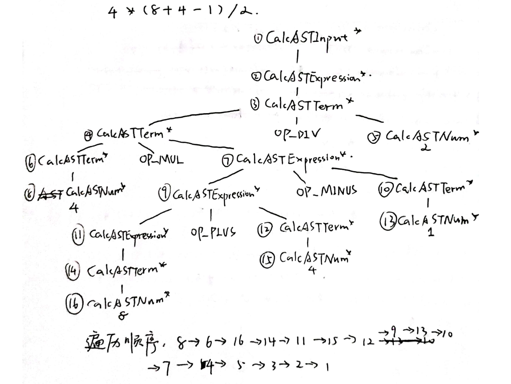

# lab2 实验报告
PB19111654 吕涵祺

## 问题1: cpp 与 .ll 的对应
请说明你的 cpp 代码片段和 .ll 的每个 BasicBlock 的对应关系。
1. assign_generator.cpp只有一个基本块，对应assign_hand.ll的main函数。
2. fun_generator.cpp中的calleefunc块对应fun_hand.ll中的callee函数，fun_generator.cpp中的entry块对应fun_hand.ll中的main函数。
3. if_generator.cpp中的entry块对应if_hand.ll中的main函数，trueBB块对应if_hand.ll中的%6块，falseBB块对应if_hand.ll中的%8块，retBB块在if_hand.ll中的%6块和%8块中复写了两次（cpp文件更改了汇编策略）。
4. while_generator.cpp中的entry块对应while_hand.ll中的main函数，checkBB块对应while_hand.ll中的%3块，loopBB块对应while_hand.ll中的%6块，retBB块对应while_hand.ll中的%11块。

## 问题2: Visitor Pattern
分析 `calc` 程序在输入为 `4 * (8 + 4 - 1) / 2` 时的行为：
1. 请画出该表达式对应的抽象语法树（使用 `calc_ast.hpp` 中的 `CalcAST*` 类型和在该类型中存储的值来表示），并给节点使用数字编号。
2. 请指出示例代码在用访问者模式遍历该语法树时的遍历顺序。

序列请按如下格式指明（序号为问题 2.1 中的编号）：  
3->2->5->1

## 问题3: getelementptr
请给出 `IR.md` 中提到的两种 getelementptr 用法的区别,并稍加解释:
  - `%2 = getelementptr [10 x i32], [10 x i32]* %1, i32 0, i32 %0`
  - `%2 = getelementptr i32, i32* %1, i32 %0`

> - 第一种gep指令的第一个偏移量指示的是相对于%1这个指向数组的指针的偏移，偏移单位为10*i32，偏移0个单位，得到的是数组头部指针。
> 
>   第二个偏移量指示的是待取元素相对于数组头部指针的偏移，偏移单位为i32，偏移%0个单位，最终取到第一个元素。
> - 第二种gep指令的第一个偏移量指示的是相对于%1这个指向i32的指针的偏移，偏移单位为i32，偏移%0个单位，最终得到的地址和第一种gep指令是一样的。

## 实验难点
理解ll语法和cpp接口常规开发流程较耗时间，理解calculator有一点难度。

## 实验反馈
这次实验体验较好，不过在理解calculator的时候花了不少时间，如果能有一个全局的注释，什么类的什么函数大概干了什么事情，能理解得更快。
